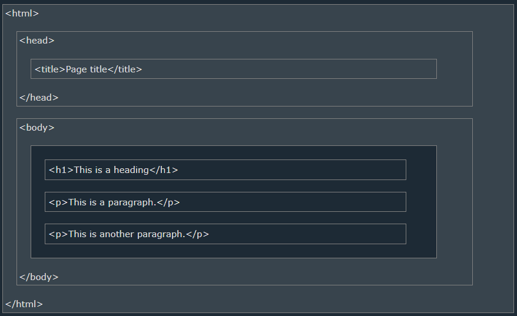

# How-to-HTML
W3 School


## HTML เริ่มต้น(HTML Introduction)
<details>  
  <summary>HTML เริ่มต้น(HTML Introduction)</summary>

  ### HTML ง่ายๆ(A Simple HTML Document)
  ```html
  <!DOCTYPE html>
  <html>
  <head>
    <title>Page Title</title>
  </head>
  <body>
      
    <h1>My First Heading</h1>
    <p>My first paragraph.</p>
      
  </body>
  </html>
  ```
<hr>

### องค์ประกอบ HTML(What is an HTML Element?)
องค์ประกอบจะต้องเริ่มด้วย tag, เนื้อหา, และตามด้วยปิด tag
| Start tag | Element content | Endtag |
| --- | ---| --- |
| `<h1>` | หัวข้อแรก | `</h1>` |
| `<p>` | ย่อหน้าแรก | `</p>` |
| `<br>` | none | none |
> Note: องค์ประกอบบ้างอย่างไม่จำเป็นต้องมีเนื้อหาและปิด tag เช่น `<br>`
<hr>

### โครงสร้างหน้าตาของ HTML(HTML Page Structure)

<hr>

### ความเป็นมาของ HTML(HTML History)
| Year | Version |
| --- | --- |
| 1989 | Tim Berners-Lee invented www |
| 1991 | Tim Berners-Lee invented HTML |
| 1993 | Dave Raggett drafted HTML+ |
| 1995 | HTML Working Group defined HTML 2.0 |
| 1997 | W3C Recommendation: HTML 3.2 |
| 1999 | W3C Recommendation: HTML 4.01 | 
| 2000 | W3C Recommendation: XHTML 1.0 |
| 2008 | WHATWG HTML5 First Public Draft |
| 2012 | WHATWG HTML5 Living Standard | 
| 2014 | W3C Recommendation: HTML5 | 
| 2016 |	W3C Candidate Recommendation: HTML 5.1 | 
| 2017 | W3C Recommendation: HTML5.1 2nd Edition | 
| 2017 | W3C Recommendation: HTML5.2 |
</details>
<hr><hr>


## พื้นฐาน HTML(HTML Basic)
<details>
  <summary>ตัวอย่างพื้นฐาน HTML(HTML Basic Exaples)</summary>

  ### HTML Documents
  ```html
  <!DOCTYPE html>
  <html>
  <body>

    <h1>My First Heading</h1>
    <p>My first paragraph.</p>

  </body>
  </html>
  ```
  <hr>

  ### คำประกาศ <!DOCTYPE>(The <!DOCTYPE> Declaration)
  ```html
  <!DOCTYPE html>
  ```
  <hr>

  ### หัวข้อ HTML(HTML Headings)
  ```html
  <h1>This is heading 1</h1>
  <h2>This is heading 2</h2>
  <h3>This is heading 3</h3>
  ```
  <hr>

  ### ย่อหน้า HTML(HTML Paragraphs)
  ```html
  <p>This is a paragraph.</p>
  <p>This is another paragraph.</p>
  ```
  <hr>

  ### ลิงค์ HTML(HTML Links)
  ```html
  <a href="https://www.w3schools.com">This is a link</a>
  ```
  <hr>

  ### รูปภาพ HTML(HTML Images)
  ```html
  
  ```
</details>
<hr><hr>


## องค์ประกอบ HTML(HTML Elements)
[HTML Tag Reference](https://www.w3schools.com/tags/default.asp)
<hr><hr>


## HTML Attributes
<details>
  <summary>The href Attribute</summary>

  ```html
  <a href="https://www.w3schools.com">Visit W3Schools</a>
  ```
  [HTML Links chapter](https://www.w3schools.com/html/html_links.asp)
  <hr>
</details>

<details>
  <summary>The Image Attributes</summary>

  #### The src Attribute
  ```html
  
  ```

  #### The width and height Attributes
  ```html
  
  ```

  #### The alt Attribute
  ```html
  
  ```
  [HTML Images chapter](https://www.w3schools.com/html/html_images.asp)
  <hr>
</details>

<details>
  <summary>The style Attribute</summary>

  ```html
  <p style="color:red;">This is a red paragraph.</p>
  ```
  [HTML Styles chapter](https://www.w3schools.com/html/html_styles.asp)
  <hr>
</details>

<details>
  <summary>The lang Attribute</summary>

  กำหนด country ในการ search

  ```html
  <!DOCTYPE html>
  <html lang="en">
  <body>
  ...
  </body>
  </html>
  ```
  Or
  ```html
  <!DOCTYPE html>
  <html lang="en-US">
  <body>
  ...
  </body>
  </html>
  ```
  [HTML Language Code Reference](https://www.w3schools.com/tags/ref_language_codes.asp)
  <hr>
</details>

<details>
  <summary>The title Attribute</summary>
  ข้อมูลเพิ่มเติมหรือ tooltip
  
  <br>

  ```html
  <p title="I'm a tooltip">This is a paragraph.</p>
  ```  
  <hr>
</details>


<details>
  <summary>Single or Double Quotes?</summary>
  ใช้แบบใดก็ได้เพื่อให้ quotes ใช้งานได้

  <br>

  ```html
  <p title='John "ShotGun" Nelson'>
  ```  
  Or
  ```html
  <p title="John 'ShotGun' Nelson">
  ```  
</details>
<hr><hr>