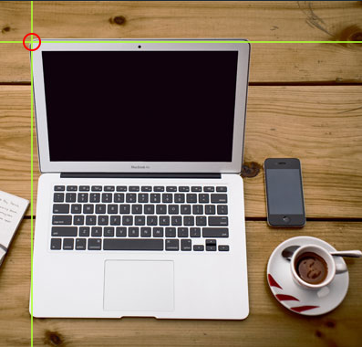

# [HTML Tutorial](https://www.w3schools.com/html/default.asp)
W3 Schools
- [HTML Introduction](https://www.w3schools.com/html/html_intro.asp)
- [HTML Editors](https://www.w3schools.com/html/html_editors.asp)
- [HTML Basic](https://www.w3schools.com/html/html_basic.asp)
- [HTML Elements](https://www.w3schools.com/html/html_elements.asp)
- [HTML Attributes](https://www.w3schools.com/html/html_attributes.asp)
- [การใช้งานหัวข้อ (Headings &lt;h&gt;)](https://www.w3schools.com/html/html_headings.asp)
- [การใช้งานเนื้อหา (Paragraphs &lt;p&gt;)](https://www.w3schools.com/html/html_paragraphs.asp)
- [การใช้งาน Styles](https://www.w3schools.com/html/html_styles.asp)
- [การใช้งานตัวหนา ตัวเอียง (Formatting)](https://www.w3schools.com/html/html_formatting.asp)
- [การอ้างอิ้งบนเว็บ (Quotations)](https://www.w3schools.com/html/html_quotation_elements.asp)
- [การใช้งาน Comments](https://www.w3schools.com/html/html_comments.asp)
- สี
  - [การใช้งานสี](https://www.w3schools.com/html/html_colors.asp)
  - [RGB](https://www.w3schools.com/html/html_colors_rgb.asp)
  - [HEX](https://www.w3schools.com/html/html_colors_hex.asp)
  - [HSL](https://www.w3schools.com/html/html_colors_hsl.asp)
- [การใช้งาน CSS](https://www.w3schools.com/html/html_css.asp)
- Links
  - [วิธี link](https://www.w3schools.com/html/html_links.asp)
  - [การกำหนดสี link](https://www.w3schools.com/html/html_links_colors.asp)
  - [กำหนด link ข้อความใน page](https://www.w3schools.com/html/html_links_bookmarks.asp)
- รูปภาพ
  - [การใช้งานรูปภาพ](https://www.w3schools.com/html/html_images.asp)
  - [การกำหนดจุดคลิกบนรูปภาพเพื่อไปหน้าที่กำหนด](https://www.w3schools.com/html/html_images_imagemap.asp)
  - [กำหนดพื้นหลังต่าง ๆ](https://www.w3schools.com/html/html_images_background.asp)
  - [การใช้งาน &lt;picture&gt; Element](https://www.w3schools.com/html/html_images_picture.asp)
- [Favicon หรือ icon](https://www.w3schools.com/html/html_favicon.asp)
- [กำหนดชื่อ Web](https://www.w3schools.com/html/html_page_title.asp)
- ตาราง
  - [การสร้างตาราง](https://www.w3schools.com/html/html_tables.asp)
  - [กำหนดความหนาและสีของตารางหรือ Border](https://www.w3schools.com/html/html_table_borders.asp)
  - [กำหนดขนาดของตาราง](https://www.w3schools.com/html/html_table_sizes.asp)
  - [การใช้งานหัวข้อของตารางกำหนดแนวนอน แนวตั้ง](https://www.w3schools.com/html/html_table_headers.asp)
  - [กำหนดช่องว่างและระยะห่างระหว่าง Cell](https://www.w3schools.com/html/html_table_padding_spacing.asp)
  - [การกำหนดหัวข้อ 1 อันหลาย Cell](https://www.w3schools.com/html/html_table_colspan_rowspan.asp)
  - [ใส่สีให้ตาราง](https://www.w3schools.com/html/html_table_styling.asp)
  - [การใช้ style กับตาราง](https://www.w3schools.com/html/html_table_colgroup.asp#legalcss)
- Lists
  - [การใช้งานขีด(-)](https://www.w3schools.com/html/html_lists.asp)
  - [กำหนดรูปแบบของขีด(-)](https://www.w3schools.com/html/html_lists_unordered.asp)
  - [การเปลี่ยนจากขีดเป้นตัวเลข](https://www.w3schools.com/html/html_lists_ordered.asp)
  - [การใช้งานขีดแบบอื่น ๆ](https://www.w3schools.com/html/html_lists_other.asp)
- [การใช้งาน block และ inline ความแตกต่างระหว่าง &lt;div&gt; และ &lt;span&gt;](https://www.w3schools.com/html/html_blocks.asp)
- [การใช้งาน &lt;div&gt; ในการสร้าง container](https://www.w3schools.com/html/html_div.asp)
- [การใช้งาน Class โดยเรียกผ่าน Attribute](https://www.w3schools.com/html/html_classes.asp)
- [การ bookmark ด้วย ID และ Links](https://www.w3schools.com/html/html_id.asp)
- [กำหนด Iframes](https://www.w3schools.com/html/html_iframe.asp)
- [การใช้งาน Javascript](https://www.w3schools.com/html/html_scripts.asp)
- [การกำหนดเส้นทางไฟล์หรือ File Paths](https://www.w3schools.com/html/html_filepaths.asp)
- [การใช้งาน Head Element เช่น &lt;title&gt;, &lt;style&gt;, &lt;meta&gt;, &lt;link&gt;, &lt;script&gt; และ &lt;base&gt;](https://www.w3schools.com/html/html_head.asp)
- [การกำหนด layout](https://www.w3schools.com/html/html_layout.asp)


<hr><hr>

# How-to-HTML
W3 School


## HTML เริ่มต้น(HTML Introduction)
<details>  
  <summary>HTML เริ่มต้น(HTML Introduction)</summary>

  ### HTML ง่ายๆ(A Simple HTML Document)
  ```html
  <!DOCTYPE html>
  <html>
  <head>
    <title>Page Title</title>
  </head>
  <body>
      
    <h1>My First Heading</h1>
    <p>My first paragraph.</p>
      
  </body>
  </html>
  ```
<hr>

### องค์ประกอบ HTML(What is an HTML Element?)
องค์ประกอบจะต้องเริ่มด้วย tag, เนื้อหา, และตามด้วยปิด tag

| Start tag | Element content | Endtag |
| --- | ---| --- |
| `<h1>` | หัวข้อแรก | `</h1>` |
| `<p>` | ย่อหน้าแรก | `</p>` |
| `<br>` | none | none |

> Note: องค์ประกอบบ้างอย่างไม่จำเป็นต้องมีเนื้อหาและปิด tag เช่น `<br>`
<hr>

### โครงสร้างหน้าตาของ HTML(HTML Page Structure)

<hr>

### ความเป็นมาของ HTML(HTML History)
| Year | Version |
| --- | --- |
| 1989 | Tim Berners-Lee invented www |
| 1991 | Tim Berners-Lee invented HTML |
| 1993 | Dave Raggett drafted HTML+ |
| 1995 | HTML Working Group defined HTML 2.0 |
| 1997 | W3C Recommendation: HTML 3.2 |
| 1999 | W3C Recommendation: HTML 4.01 | 
| 2000 | W3C Recommendation: XHTML 1.0 |
| 2008 | WHATWG HTML5 First Public Draft |
| 2012 | WHATWG HTML5 Living Standard | 
| 2014 | W3C Recommendation: HTML5 | 
| 2016 |	W3C Candidate Recommendation: HTML 5.1 | 
| 2017 | W3C Recommendation: HTML5.1 2nd Edition | 
| 2017 | W3C Recommendation: HTML5.2 |
<hr>
</details>
<hr>


## พื้นฐาน HTML(HTML Basic)
<details>
  <summary>ตัวอย่างพื้นฐาน HTML(HTML Basic Exaples)</summary>

  ### HTML Documents
  ```html
  <!DOCTYPE html>
  <html>
  <body>

    <h1>My First Heading</h1>
    <p>My first paragraph.</p>

  </body>
  </html>
  ```
<hr>

  ### คำประกาศ <!DOCTYPE>(The <!DOCTYPE> Declaration)
  ```html
  <!DOCTYPE html>
  ```
<hr>

  ### หัวข้อ HTML(HTML Headings)
  ```html
  <h1>This is heading 1</h1>
  <h2>This is heading 2</h2>
  <h3>This is heading 3</h3>
  ```
<hr>

  ### ย่อหน้า HTML(HTML Paragraphs)
  ```html
  <p>This is a paragraph.</p>
  <p>This is another paragraph.</p>
  ```
<hr>

  ### ลิงค์ HTML(HTML Links)
  ```html
  <a href="https://www.w3schools.com">This is a link</a>
  ```
<hr>

  ### รูปภาพ HTML(HTML Images)
  ```html
  
  ```
<hr>
</details>
<hr>


## องค์ประกอบ HTML(HTML Elements)
[HTML Tag Reference](https://www.w3schools.com/tags/default.asp)
<hr>


## HTML Attributes
<details>
  <summary>The href Attribute</summary>

  ```html
  <a href="https://www.w3schools.com">Visit W3Schools</a>
  ```
  [HTML Links chapter](https://www.w3schools.com/html/html_links.asp)
<hr>
</details>

<details>
  <summary>The Image Attributes</summary>

  #### The src Attribute
  ```html
  
  ```

  #### The width and height Attributes
  ```html
  
  ```

  #### The alt Attribute
  ```html
  
  ```
  [HTML Images chapter](https://www.w3schools.com/html/html_images.asp)
<hr>
</details>

<details>
  <summary>The style Attribute</summary>

  ```html
  <p style="color:red;">This is a red paragraph.</p>
  ```
  [HTML Styles chapter](https://www.w3schools.com/html/html_styles.asp)
<hr>
</details>

<details>
  <summary>The lang Attribute</summary>

  กำหนด country ในการ search

  ```html
  <!DOCTYPE html>
  <html lang="en">
  <body>
  ...
  </body>
  </html>
  ```
  Or
  ```html
  <!DOCTYPE html>
  <html lang="en-US">
  <body>
  ...
  </body>
  </html>
  ```
  [HTML Language Code Reference](https://www.w3schools.com/tags/ref_language_codes.asp)
<hr>
</details>

<details>
  <summary>The title Attribute</summary>
  ข้อมูลเพิ่มเติมหรือ tooltip
  
  <br>

  ```html
  <p title="I'm a tooltip">This is a paragraph.</p>
  ```  
<hr>
</details>


<details>
  <summary>Single or Double Quotes?</summary>
  ใช้แบบใดก็ได้เพื่อให้ quotes ใช้งานได้

  <br>

  ```html
  <p title='John "ShotGun" Nelson'>
  ```  
  Or
  ```html
  <p title="John 'ShotGun' Nelson">
  ```  
<hr>
</details>
<hr>


## การใช้งานหัวข้อ(HTML Headings)
<details>
  <summary>HTML Headings</summary>

  ```html
  <h1>Heading 1</h1>
  <h2>Heading 2</h2>
  <h3>Heading 3</h3>
  <h4>Heading 4</h4>
  <h5>Heading 5</h5>
  <h6>Heading 6</h6>
  ```
<hr>  
</details>

<details>
  <summary>กำหนดขนาดอักษรหัวข้อ(Bigger Headings)</summary>

  ```html
  <h1 style="font-size:60px;">Heading 1</h1>
  ```  
<hr>
</details>

<details>
  <summary>HTML Tag Reference</summary>

  | Tag | Description |
  | --- | ---|
  | `<html>` | กำหนดให้ว่าเป็น HTML |
  | `<body>` | กำหนดส่วนเนื้อหา |
  | `<h1> to <h6>` | กำหนดหัวข้อ |
  [HTML Tag Reference](https://www.w3schools.com/tags/default.asp)
<hr>
</details>
<hr>


## วิธีใช้งานย่อหน้า(HTML Paragraphs)
<details>
  <summary>HTML Paragraphs</summary>

  ```html
  <p>This is a paragraph.</p>
  <p>This is another paragraph.</p>
  ```  
<hr>
</details>

<details>
  <summary>การแสดงผล(HTML Display)</summary>
  ย่อหน้าจะตัดเว้นวรรคออกไม่ว่างจะใช้เยอะแค่ไหน
  <br>
  input:

  ```html
  <p>
  This paragraph
  contains a lot of lines
  in the source code,
  but the browser
  ignores it.
  </p>

  <p>
  This paragraph
  contains         a lot of spaces
  in the source         code,
  but the        browser
  ignores it.
  </p>
  ```  
  output:
    <p>
  This paragraph
  contains a lot of lines
  in the source code,
  but the browser
  ignores it.
  </p>

  <p>
  This paragraph
  contains         a lot of spaces
  in the source         code,
  but the        browser
  ignores it.
  </p>
<hr>
</details>

<details>
  <summary>ขีดเส้นแนวนอน(HTML Horizontal Rules)</summary>

  ```html
  <hr>
  ```  
<hr>
</details>

<details>
  <summary>ขึ้นบรรทัดใหม่(HTML Line Breaks)</summary>
  input:

  ```html
  <p>This is<br>a paragraph<br>with line breaks.</p>
  ```  
  output:
  <p>This is<br>a paragraph<br>with line breaks.</p>
<hr>
</details>

<details>
  <summary>ย่อหน้าแบบไม่กำหนดรูปแบบ(The HTML &lt;pre&gt; Element)</summary>
  &lt;pre&gt; จะไม่สนใจการเว้นวรรค

  ```html
  <pre>
    My Bonnie lies over the ocean.

    My Bonnie lies over the sea.

    My Bonnie lies over the ocean.

    Oh, bring back my Bonnie to me.
  </pre>
  ```  
<hr>
</details>

<details>
  <summary>HTML Tag Reference</summary>

  | Tag | Description |
  | --- | ---|
  | `<p>` | กำหนดเป็น ย่อหน้า |
  | `<hr>` | ขีดเส้นแนวนอน |
  | `<br>` | ขึ้นบรรทัดใหม่ |
  | `<pre>` | กำหนดข้อความแบบไม่จัดรูปแบบ |
<hr>
</details>
<hr>


## กำหนดรูปแบบ HTML(HTML Styles)
กำหนดองค์ประกอบ เช่น color, font, size
<details>
  <summary>กำหนดรูปแบบ(The HTML Style Attribute)</summary>

  ```html
  <tagname style="property:value;">
  ```  
<hr>
</details>

<details>
  <summary>สีพื้นหลัง(Background Color)</summary>
  input:

  ```html
  <body style="background-color:powderblue;">

  <h1 style="background-color:powderblue;">This is a heading</h1>
  <p style="background-color:tomato;">This is a paragraph.</p>

  </body>
  ```  
  output:
  <body style="background-color:powderblue;">

  <h1 style="background-color:powderblue;">This is a heading</h1>
  <p style="background-color:tomato;">This is a paragraph.</p>

  </body>
<hr>
</details>

<details>
  <summary>สีข้อความ(Text Color)</summary>
  input:

  ```html
  <h1 style="color:blue;">This is a heading</h1>
  <p style="color:red;">This is a paragraph.</p>
  ```  
  output:
  <h1 style="color:blue;">This is a heading</h1>
  <p style="color:red;">This is a paragraph.</p>
<hr>
</details>

<details>
  <summary>กำหนดรูปแบบ Font(Fonts)</summary>
  input:

  ```html
  <h1 style="font-family:verdana;">This is a heading</h1>
  <p style="font-family:courier;">This is a paragraph.</p>
  ```  
  output:
  <h1 style="font-family:verdana;">This is a heading</h1>
  <p style="font-family:courier;">This is a paragraph.</p>
<hr>
</details>

<details>
  <summary>ขนาด Font(Text Size)</summary>
  input:

  ```html
  <h1 style="font-size:300%;">This is a heading</h1>
  <p style="font-size:160%;">This is a paragraph.</p>
  ```  
  output:
  <h1 style="font-size:300%;">This is a heading</h1>
  <p style="font-size:160%;">This is a paragraph.</p>
<hr>
</details>

<details>
  <summary>ตำแหน่ง Font(Text Alignment)</summary>
  input:

  ```html
  <h1 style="text-align:center;">Centered Heading</h1>
  <p style="text-align:center;">Centered paragraph.</p>
  ```  
  output:
  <h1 style="text-align:center;">Centered Heading</h1>
  <p style="text-align:center;">Centered paragraph.</p>
<hr>
</details>
<hr>


## รูปแบบ Font(HTML Formatting)
<details>
  <summary>รูปแบบองค์ประกอบ(HTML Formatting Elements)</summary>

  | Tag | Description |
  | --- | ---|
  | `<b>` | ตัวหนา |
  | `<strong>` | ตัวหนาและสำคัญกว่า |
  | `<i>` | ตัวเอียง |
  | `<em>` | ตัวเอียงแต่สำคัญกว่า |
  | `<mark>` | Highlight |
  | `<small>` | กำหนดข้อความให้เล็ก |
  | `<del>` | ขีดเส้นกลางทับ Font |
  | `<ins>` | ขีดเส้นใต้ |
  | `<sub>` | ตัวห้อย |
  | `<sup>` | ยกกำลัง |
<hr>
</details>
<hr>


## การอ้างอิ้ง(HTML Quotations)
<details>
  <summary>การอ้างอิ้งแบบบล็อก(HTML &lt;blockquote&gt; for Quotations)</summary>

    ```html
    <p>Here is a quote from WWF's website:</p>
    <blockquote cite="http://www.worldwildlife.org/who/index.html">
    For 60 years, WWF has worked to help people and nature thrive. As the world's leading conservation organization, WWF works in nearly 100 countries. At every level, we collaborate with people around the world to develop and deliver innovative solutions that protect communities, wildlife, and the places in which they live.
    </blockquote>
    ``` 
<hr> 
</details>

<details>
  <summary>การอ้างอิ้งแบบสั้น(HTML &lt;q&gt; for Short Quotations)</summary>
  input:

  ```html
  <p>WWF's goal is to: <q>Build a future where people live in harmony with nature.</q></p>
  ```  
  output:
  <p>WWF's goal is to: <q>Build a future where people live in harmony with nature.</q></p>
<hr>
</details>

<details>
  <summary>การอ้างอิ้งงานแบบแสดงการใช้คำย่อ(HTML &lt;abbr&gt; for Abbreviations)</summary>
  input:

  ```html
  <p>The <abbr title="World Health Organization">WHO</abbr> was founded in 1948.</p>
  ```  
  output:
  <p>The <abbr title="World Health Organization">WHO</abbr> was founded in 1948.</p>
<hr>
</details>

<details>
  <summary>การอ้างแบบที่อยู่(HTML <&lt;address&gt; for Contact Information)</summary>
  input:

  ```html
  <address>
  Written by John Doe.<br>
  Visit us at:<br>
  Example.com<br>
  Box 564, Disneyland<br>
  USA
  </address>
  ```  
  output:
  <address>
  Written by John Doe.<br>
  Visit us at:<br>
  Example.com<br>
  Box 564, Disneyland<br>
  USA
  </address>
<hr>
</details>

<details>
  <summary>การอ้างอิ้งของหัวข้อชิ้นงาน(HTML &lt;cite&gt; for Work Title)</summary>
  input:

  ```html
  <p><cite>The Scream</cite> by Edvard Munch. Painted in 1893.</p>
  ``` 
  output: 
  <p><cite>The Scream</cite> by Edvard Munch. Painted in 1893.</p>
<hr>
</details>

<details>
  <summary>กำหนดทิศทางข้อความ(HTML &lt;bdo&gt; for Bi-Directional Override)</summary>
  input:

  ```html
  <bdo dir="rtl">This text will be written from right to left</bdo>
  ```
  output:  
  <bdo dir="rtl">This text will be written from right to left</bdo>
<hr>
</details>

<details>
  <summary>HTML Quotation and Citation Elements</summary>

  | Tag | Description |
  | --- | ---|
  | `<abbr>` | การอ้างอิ้งแบบใช้คำย่อ |
  | `<address>` | การอ้างอิ้งแบบที่อยู่ |
  | `<bdo>` | กำหนดทิศทางข้อความ ทิศทางจริงๆเลย |
  | `<blockquote>` | การอ้างอิ้งแบบเอกสาร |
  | `<cite>` | การอ้างอิ้งชื่อผลงาน |
  | `<q>` | การอ้างอิ้งแบบสั้น |
<hr>
</details>
<hr>


## ความคิดเห็น(HTML Comments)
<details>
  <summary>แท็กความคิดเห็น(HTML Comment Tag)</summary>

  ```html
  <!-- Write your comments here -->

  <p>This is a paragraph.</p>
  <!--
  <p>Look at this cool image:</p>
  
  -->
  <p>This is a paragraph too.</p>

  <p>This <!-- great text --> is a paragraph.</p>
  ```  
<hr>
</details>
<hr>


## การใช้งานสี(HTML Colors)
<details open>
  <summary>สี(Colors)</summary>
  <details>
    <summary>สีพื้นหลัง(Background Color)</summary>
    input:

    ```html
    <h1 style="background-color:DodgerBlue;">Hello World</h1>
    <p style="background-color:Tomato;">Lorem ipsum...</p>
    ```  
    output:
    <h1 style="background-color:DodgerBlue;">Hello World</h1>
    <p style="background-color:Tomato;">Lorem ipsum...</p>
  <hr>
  </details>

  <details>
    <summary>สีตัวอักษร(Text Color)</summary>
    input:

    ```html
    <h1 style="color:Tomato;">Hello World</h1>
    <p style="color:DodgerBlue;">Lorem ipsum...</p>
    <p style="color:MediumSeaGreen;">Ut wisi enim...</p>
    ```  
    output:
    <h1 style="color:Tomato;">Hello World</h1>
    <p style="color:DodgerBlue;">Lorem ipsum...</p>
    <p style="color:MediumSeaGreen;">Ut wisi enim...</p>
  <hr>
  </details>

  <details>
    <summary>สีกรอบ(Border Color)</summary>
    input:

    ```html
    <h1 style="border:2px solid Tomato;">Hello World</h1>
    <h1 style="border:2px solid DodgerBlue;">Hello World</h1>
    <h1 style="border:2px solid Violet;">Hello World</h1>
    ```  
    output:
    <h1 style="border:2px solid Tomato;">Hello World</h1>
    <h1 style="border:2px solid DodgerBlue;">Hello World</h1>
    <h1 style="border:2px solid Violet;">Hello World</h1>
  <hr>
  </details>

  <details>
    <summary>ค่าของสี(Color Values)</summary>
    input:

    ```html
    <h1 style="background-color:rgb(255, 99, 71);">rgb(255, 99, 71)</h1>
    <h1 style="background-color:#ff6347;">#ff6347</h1>
    <h1 style="background-color:hsl(9, 100%, 64%);">hsl(9, 100%, 64%)</h1>

    <h1 style="background-color:rgba(255, 99, 71, 0.5);">rgba(255, 99, 71, 0.5)</h1>
    <h1 style="background-color:hsla(9, 100%, 64%, 0.5);">hsla(9, 100%, 64%, 0.5)</h1>
    ```  
    output:
    <h1 style="background-color:rgb(255, 99, 71);">rgb(255, 99, 71)</h1>
    <h1 style="background-color:#ff6347;">#ff6347</h1>
    <h1 style="background-color:hsl(9, 100%, 64%);">hsl(9, 100%, 64%)</h1>

    <h1 style="background-color:rgba(255, 99, 71, 0.5);">rgba(255, 99, 71, 0.5)</h1>
    <h1 style="background-color:hsla(9, 100%, 64%, 0.5);">hsla(9, 100%, 64%, 0.5)</h1>
  <hr>
  </details>
<hr>
</details>

<details>
  <summary>RGB</summary>
  rgb(red, green, blue)<br><br>

  rgb(60, 60, 60)<br>
  rgb(240, 240, 240)

  rgba(red, green, blue, alpha)<br>
  alpha = ความโปร่งใส
<hr>
</details>

<details>
  <summary>HEX</summary>
  #rrggbb <br><br>

  #404040<br>
  #f8f8f8
<hr>
</details>

<details>
  <summary>HSL</summary>
  hsl(hue, saturation, lightness)<br><br>

  hsla(hue, saturation, lightness, alpha)
<hr>
</details>
<hr>


## HTML CSS
<details>
  <summary>HTML Styles - CSS</summary>

  ### การใช้งาน CSS(Using CSS)
  มี 3 วิธี
  1. Inline - การใช้ `style` ใน HTML element
  2. Internal - การใช้ `<style>` ใน `<head>` section
  3. External - การใช้ `<link>` เพื่อใช้งานกับ CSS file ที่สร้างเอง

  ### Inline
  ```html
  <h1 style="color:blue;">A Blue Heading</h1>

  <p style="color:red;">A red paragraph.</p>
  ``` 

  ### Internal CSS
  การใช้งาน `<style>` ใน `<head>` Section
  ```html
  <!DOCTYPE html>
  <html>
  <head>
  <style>
  body {background-color: powderblue;}
  h1   {color: blue;}
  p    {color: red;}
  </style>
  </head>
  <body>

  <h1>This is a heading</h1>
  <p>This is a paragraph.</p>

  </body>
  </html>
  ``` 

  ### External CSS
  เพิ่ม `<link>` ใน `<head>` Section
  ```html
  <!DOCTYPE html>
  <html>
  <head>
    <link rel="stylesheet" href="styles.css">
  </head>
  <body>

  <h1>This is a heading</h1>
  <p>This is a paragraph.</p>

  </body>
  </html>
  ``` 
  "styles.css":
  ```css
  body {
    background-color: powderblue;
  }
  h1 {
    color: blue;
  }
  p {
    color: red;
  }
  ``` 
 <hr> 
</details>

<details>
  <summary>CSS Color, Fonts and Sizes</summary>
  
  `color` - สีของสิ่งต่างๆ<br>
  `font-family` - กำหนดรูปแบบของ font<br>
  `font-size` - กำหนดขนาดของ font
  ```html
  <head>
  <style>
  h1 {
    color: blue;
    font-family: verdana;
    font-size: 300%;
  }
  p {
    color: red;
    font-family: courier;
    font-size: 160%;
  }
  </style>
  </head>
  ```  
<hr>
</details>

<details>
  <summary>กรอบข้อความ(CSS Border)</summary>

  ```css 
    p {
    border: 2px solid powderblue;
  }
  ```  
<hr>   
</details>

<details>
  <summary>ความห่างด้านในของกรอบ(CSS Padding)</summary>

  ```css
  p {
    border: 2px solid powderblue;
    padding: 30px;
  }
  ```  
<hr>
</details>

<details>
  <summary>ความห่างด้านนอกของกรอบ(CSS Margin)</summary>

  ```css
  p {
    border: 2px solid powderblue;
    margin: 50px;
  }
  ```  
<hr>
</details>

<details>
  <summary>Link to External CSS</summary>
  สามารถใช้ Full URL หรือ path ในการใช้งานได้

  ```html
  <link rel="stylesheet" href="https://www.w3schools.com/html/styles.css">

  <link rel="stylesheet" href="/html/styles.css">

  <link rel="stylesheet" href="styles.css">
  ```  
  [HTML File Paths](https://www.w3schools.com/html/html_filepaths.asp)
<hr>
</details>

<details>
  <summary>Chapter Summary</summary>

  - ใช้ `style` เพื่อกำหนดแบบ inline
  - ใช้ `<style>` เพื่อกำหนดแบบ internal CSS
  - ใช้ `<link>` เพื่อกำหนดแบบ external CSS
  - ใน `<head>` section กำหนด &lt;style&gt; and &lt;link&gt;
  - ใช้ `color` ในการกำหนดสีข้อความ
  - ใช้ `font-family` ในการกำหนดรูปแบบข้อความ
  - ใช้ `font-size` ในการกำหนดขนาดข้อความ
  - ใช้ `border` เพื่อสร้างกรอบของข้อความ
  - ใช้ `padding` เพื่อกำหนดความห่างของกรอบด้านในข้อความ
  - ใช้ `margin` เพื่อกำหนดความห่างของกรอบด้านนอกข้อความ

  [CSS Tutorial](https://www.w3schools.com/css/default.asp)
<hr>
</details>

<details>
  <summary>HTML Style Tags</summary>

  | Tag | Description |
  | --- | ---|
  | `<style>` | กำหนดรูปแบบ |
  | `<link>` | กำหนด URL ภายนอกหรือ path |
  [HTML Tag Reference](https://www.w3schools.com/tags/default.asp)
<hr>
</details>
<hr>


## HTML Links
<details>
<summary>Links</summary>

### HTML Links - Syntax
```html
<a href="url">link text</a>

<a href="https://www.w3schools.com/">Visit W3Schools.com!</a>
```
<hr>

### HTML Links - The target Attribute
`target` ใช้ในการกำหนดเป้าหมายว่าจะทำอะไร
- `_self` - เปิดใน Tab เดียวกัน
- `_blank` - เปิดใน Tab ใหม่
- `_parent` - เปิดใน parent frame
- `_top` - เปิดเป็น full body
```html
<a href="https://www.w3schools.com/" target="_blank">Visit W3Schools!</a>
```
<hr>

### Absolute URLs vs. Relative URLs
```html
<h2>Absolute URLs</h2>
<p><a href="https://www.w3.org/">W3C</a></p>
<p><a href="https://www.google.com/">Google</a></p>

<h2>Relative URLs</h2>
<p><a href="html_images.asp">HTML Images</a></p>
<p><a href="/css/default.asp">CSS Tutorial</a></p>
```

### HTML Links - Use an Image as a Link(ใช้รูปภาพในการ Link)
```html
<a href="default.asp">

</a>
``` 
<hr>

### Link to an Email Address
ใช้ `mailto:` เพื่อลิงค์ไปที่ email
```html
<a href="mailto:someone@example.com">Send email</a>
```
<hr>

### Button as a Link(ลิงค์ด้วยปุ่ม)
ใช้ `mailto:` เพื่อลิงค์ไปที่ email
```html
<button onclick="document.location='default.asp'">HTML Tutorial</button>
```
[JavaScript](https://www.w3schools.com/js/default.asp)
<hr>

### Link Title
```html
<a href="https://www.w3schools.com/html/" title="Go to W3Schools HTML section">Visit our HTML Tutorial</a>
```
<hr>

### Chapter Summary
- ใช้ `<a>` กำหนดลิงค์
- ใช้ `href` กำหนดที่อยู่ลิงค์
- ใช้ `target` กำหนดลักษณะการเปิดลิงค์
- ใช้ `` กำหนดรูปภาพและกำหนดลิงค์ใน `<a>`
- ใช้ `mailto:` เพื่อกำหนดลิงค์ไปที่ Email
<hr>

### HTML Link Tag
| Tag | Description |
| --- | ---|
| `<a>` | กำหนดลิงค์ |
[HTML Tag Reference](https://www.w3schools.com/tags/default.asp)
<hr>
</details>

<details>
<summary>Link Colors</summary>

### HTML Link Colors

พื้นฐานของการตั้งค่า
- ลิงค์ที่ยังไม่เข้าชมเป็นสีน้ำเงิน
- ลิงค์ที่เข้าชมแล้วจะเป็นสีม่วง
- ลิงค์ที่ใช้งานอยู่จะเป็นสีแดง
```html
<style>
a:link {
  color: green;
  background-color: transparent;
  text-decoration: none;
}

a:visited {
  color: pink;
  background-color: transparent;
  text-decoration: none;
}

a:hover {
  color: red;
  background-color: transparent;
  text-decoration: underline;
}

a:active {
  color: yellow;
  background-color: transparent;
  text-decoration: underline;
}
</style>
``` 
<hr>

### Link Buttons

```html
<style>
a:link, a:visited {
  background-color: #f44336;
  color: white;
  padding: 15px 25px;
  text-align: center;
  text-decoration: none;
  display: inline-block;
}

a:hover, a:active {
  background-color: red;
}
</style>
``` 
[CSS Tutorial](https://www.w3schools.com/css/default.asp) 
<hr>

### HTML Link Tags

| Tag | Description |
| --- | ---|
| `<a>` | ลิงค์ |
<hr>
</details>

<details>
<summary>Link Bookmarks</summary>

### Create a Bookmark in HTML

ให้ใช้ `id` ในการสร้าง bookmark
```html
<h2 id="C4">Chapter 4</h2>
```  
จากนั้นเพิ่มลิงค์ bookmark ในหน้าเพจ
```html
<a href="#C4">Jump to Chapter 4</a>
``` 
หรือสามารถเพิ่มลิงค์จากหน้าอื่นได้ด้วย
```html
<a href="html_demo.html#C4">Jump to Chapter 4</a>
```  
<hr>
</details>

<details>
<summary>Chapter Summary</summary>

- ใช้ `id` (id="value") กำหนดจุด bookmark ในหน้าเพจ
- ใช้ `href` (href="#value") กำหนดลิงค์ bookmark
<hr>
</details>

<details>
<summary>HTML Link Tags</summary>

| Tag | Description |
| --- | ---|
| `<a>` | ลิงค์ |
<hr>
</details>
<hr>


## HTML Images
<details>
<summary>Images</summary>

```html


``` 
<hr>

### HTML Images Syntax
การใช้งาน `` ต้องมี attributes 2 อย่าง

- src - กำหนด path ของรูปภาพ
- alt - กำหนดชื่อของรูปภาพ
<hr>

### The src Attribute
กำหนดที่อยู่ของรูปภาพ
```html

```
<hr>

### The alt Attribute
กำหนดคำอธิบายรูปภาพจะแสดงแทนถ้าภาพใช้งานไม่ได้
```html


```  
<hr>

### Image Size - Width and Height
สามารถใช้ `style` กำหนดความยาวและกว้างของรูปภาพ
```html

``` 
หรือใช้ใน `width` และ `height` ใน attributes ได้เลย
```html

``` 
หน่วยของขนาดรูปภาพจะเป็น pixels
<hr>

### Width and Heaight, or Style?
`width`,`hright` และ `style` สามารถทำงานได้ทั้งหมดใน HTML
แต่ยังไงก็ตาม `style` จะไม่ทำให้รูปภาพเปลี่ยนไปจากเดิมแต่เพิ่มขนาด
```html
<!DOCTYPE html>
<html>
<head>
<style>
img {
  width: 100%;
}
</style>
</head>
<body>


</body>
</html>
```  
<hr>

### Images on Another Server/Website
สามารถใช้ (full) URL ในการระบุบน `src` ได้
```html

``` 
<hr>

### Animated Images
HTML ใช้ GIF ได้
```html

``` 
<hr>

### Image as a Link
ถ้าจะลิงค์รูปภาพ ใช้ `` ใน tag `<a>`
```html
<a href="default.asp">
  
</a>
``` 
<hr>

### Image Floating
ใช้ CSS `float` เพื่อให้รูปภาพไปอยู่ข้างข้อความได้ โดยการกำหนด left หรือ right
```html
<p>
The image will float to the right of the text.</p>

<p>
The image will float to the left of the text.</p>
```  
[CSS Float Tutorial](https://www.w3schools.com/css/css_float.asp)
<hr>

### Comman Image Formats
นี้คือประเภทของไฟล์รูปภาพที่ Browser ทั้งหมดรองรับ
| Abbreviation | File Format | Formats |
| --- | --- | --- |
| APNG | Animation เคลื่อนไหว | .apng |
| GIF | รูปภาพเคลื่อนไหว | .gif |
| ICO | icon | .ico .cur |
| JPEG | รูปภาพ | .jpg .jpeg .jfif .pjpeg .pjp |
| PNG | รูปภาพ | .png |
| SVG | รูปภาพ | .svg |
<hr>

### Chapter Summary
- ใช้ `` เพื่อกำหนดรูปภาพ
- ใช้ `src` เพื่อกำหนด URL หรือ path ของรูปภาพ
- ใช้ `alt` เพื่อกำหนดข้อความรูปภาพในกรณีที่ภาพไม่แสดง
- ใช้ `width` และ `height` เพื่อกำหนดขนาดของภาพ
- ใช้ `float` เพื่อกำหนดให้แสดงอยู่ข้างข้อความด้วย left หรือ right
<hr>

### HTML Image Tags
| Tag | Descriotion |
| --- | ---|
| `` | กำหนดรูปภาพ |
| `<map>` | กำหนดแผนที่ภาพ |
| `<area>` | กำหนดแผนที่ภาพที่คลิกได้ |
| `<picture>` | กำหนดรูปภาพแบบหลายอัน |
[HTML Tag Reference](https://www.w3schools.com/tags/default.asp)
<hr><hr>
</details>

<details>
<summary>Image Map</summary>
tag HTML `&lt;map&gt;` แผนที่รูปภาพ สามารถกำหนดให้คลิกได้เฉพาะจุดด้วย `&lt;area&gt;` tag เพื่อกำหนดพื้นที่

```html


<map name="workmap">
  <area shape="rect" coords="34,44,270,350" alt="Computer" href="computer.htm">
  <area shape="rect" coords="290,172,333,250" alt="Phone" href="phone.htm">
  <area shape="circle" coords="337,300,44" alt="Coffee" href="coffee.htm">
</map>
```  
### The Image
ใช้ `` tag แล้วเพิ่ม `usemap` ใน attribute
```html

```
value `usermap` ต้องเริ่มด้วย # แล้วตามด้วยชื่อ

### Create Image Map
ใช้ `<map>` เพื่อสร้างแผนที่รูปภาพ และ link ภาพด้วย `name` ใน attribute
```html
<map name="workmap">
``` 

### The Areas
สามารถกำหนดพื้นที่ในการคลิกบนรูปภาพได้ด้วย `<area>` element

#### Shape
สามารถเลิอกรูปทรงในการกำหนดพื้นที่ได้
- `rect` - สี่เหลี่ยม
- `circle` - วงกลม
- `poly` - polygon รูปทรงหลายเหลี่ยม
- `default` - ทั้งรูป
แล้วต้องกำหนดพื้นที่ในการคลิกด้วย

### Shape="rect"
การใช้งาน `shape="rect"` จะกำหนดพื้นที่แบบ แกน x, แกน y<br>
จากภาพกำหนดจุดแรก `34,44`



และกำหนด `270,350`


ตอนนี้เราได้สร้างจุดที่สามารถคลิกได้บนรูปภาพแล้ว
```html
<area shape="rect" coords="34, 44, 270, 350" href="computer.htm">
```  
พื้นที่ ที่สามารถคลิกได้ แล้วถูกส่งไปที่หน้า "computer.htm"


<hr>

### Shape="circle"
ถ้าต้องการใช้รูปทรงวงกลม ให้หาพื้นที่จุดตรงกลางของจุดนั้น

`337,300`


แล้วกำหนด radias ของวงกลม

`44` pixels


ตอนนี้เราได้สร้างพื้นที่รูปทรงวงกลมที่คลิกได้แล้ว
```html
<area shape="circle" coords="337, 300, 44" href="coffee.htm">
``` 
ตอนนี้ ถ้าคลิกจะถูกส่งไปที่หน้า "coffee.htm"
<hr>

### Shape="poly"
`shape="poly"` สามารถกำหนดจุดได้หลายจุด โดยเกิดจากเส้รตรงหลายอันมาร่วมกัน<br>
เราต้องหาจุด x และ y ทั้งหมดของเป้าหมาย


```html
<area shape="poly" coords="140,121,181,116,204,160,204,222,191,270,140,329,85,355,58,352,37,322,40,259,103,161,128,147" href="croissant.htm">
``` 
พื้นที่ ที่สามารถคลิกได้แล้วจะถูกส่งไปที่หน้า "croissant.htm"


### Image Map and JavaScript
พื้นที่คลิกยังสามารถเรียกใช้งาน JavaScript ได้ด้วย

เพิ่ม `onclick` event เข้าไปใน `<area>` element เพื่อใช้งาน JavaScript
```html
<map name="workmap">
  <area shape="circle" coords="337,300,44" href="coffee.htm" onclick="myFunction()">
</map>

<script>
function myFunction() {
  alert("You clicked the coffee cup!");
}
</script>
```  
<hr>

### Chapter Summary
- ใช้ `<map>` element กำหนดภาพแบบกำหนดพื้นที่
- ใช้ `<area>` element กำหนดพื้นที่ ที่ต้องการคลิกบนรูปภาพ
- ใช้ `usemap` attribute ของ `` element เพื่อชี้ไปที่รูปภาพ
<hr>

### HTML Image Tags
| Tag | Description |
| --- | ---|
| `` | กำหนดรูปภาพ |
| `<map>` | กำหนดภาพแบบพื้นที่ |
| `<area>` | กำหนดจุดที่คลิกได้บนภาพ |
| `<picture>` | กำหนดว่าเป็นหลายภาพ |
<hr><hr>
</details>

<details>
<summary>Background Images</summary>

### Background Image on an HTML element
เพิ่มภาพพื้นหลังข้อความได้ ด้วยการใช้ `style` attribute และ CSS `background-image`
```html
<p style="background-image: url('img_girl.jpg');">
``` 
สามารถระบุโดยใน `<style>` element ใน `<head>` section ได้
```html
<style>
p {
  background-image: url('img_girl.jpg');
}
</style>
```
<hr>

### Background Image on a Page
ถ้าต้องการใส่พื้นหลังของหน้าเพจ ต้องระบุใน `body` element
```html
<style>
body {
  background-image: url('img_girl.jpg');
}
</style>
``` 
<hr>

### Background Repeat
หากใช้ภาพพื้นหลังที่เล็กเกินไป จะทำการวางภาพซ้ำๆ ทั้งแนวนอนและแนวตั้ง

เราสามารถกำหนดไม่ให้ทำภาพซ้ำได้ด้วยการใช้ `background-repeat` property แล้วใส่ `no-repeat`
```html
<style>
body {
  background-image: url('example_img_girl.jpg');
  background-repeat: no-repeat;
}
</style>
``` 
<hr>

### Background Cover
ถ้าต้องการให้ภาพครอบคลุมทั้งหน้าเพจ ให้ใช้ `background-size` property ใส่ `cover`

แล้วถ้าต้องการให้ภาพพื้นหลังครอบคลุมทั้งเพจอยู่เสมอหรือ fix พื้นหลัง ให้ใช้ `background-attachment` property ใส่ `fixed`

ภาพจะไม่มีการยืดและยึดสัดส่วนเดิม
```html
<style>
body {
  background-image: url('img_girl.jpg');
  background-repeat: no-repeat;
  background-attachment: fixed;
  background-size: cover;
}
</style>
``` 
<hr>

### Background Stretch
หนกต้องการให้ภาพขยายทั้งหน้าเพจ โดยไม่สนขนาดเดิมของภาพ ให้ใช้ `background-size` ใส่ `100% 100%`

```html
<style>
body {
  background-image: url('img_girl.jpg');
  background-repeat: no-repeat;
  background-attachment: fixed;
  background-size: 100% 100%;
}
</style>
```  
<hr>

### Learn More CSS
เรียนรู้การใช้งานพื้นหลังเพิ่มเตอมได้ที่ [CSS Background Tutorial](https://www.w3schools.com/css/css_background.asp)
<hr><hr>
</details>

<details>
<summary>HTML &lt;picture&gt; Element</summary>

`<picture>` สามารถช่วยให้คุณแสดงรูปที่ขนาดหน้าจอแตกต่างกันได้

### The HTML &lt;picture&gt; Element

`picture` element สามารถใช้ `<source>` element กำหนดได้มากกว่า 1 อัน สามารถกำหนดภาพมาใช้งานด้วย `srcset` attribute 

`<source>` element ใช้ `media` attribute ในการกำหนดการแสดงของอุปกรณ์

```html
<picture>
  <source media="(min-width: 650px)" srcset="img_food.jpg">
  <source media="(min-width: 465px)" srcset="img_car.jpg">
  
</picture>
``` 
<hr>

### When to use the Picture Element

มี 2 อย่างในการใช้งาน `<picture>`
1. Bandwidth<br>
หากใช้งานขนาดหน้าจอเล็ก ไม่จำเป็นต้องใช้ภาพขนาดใหญ่ `<source>` จะแมตกับขนาดของภาพ
2. Format Support
Browser หรืออุปกรณ์ไม่ได้รองรับรูปภาพทั้งหมด เมื่อใช้ `<picture>` element สามารถเพิ่มรูปภาพทั้งหมดได้แล้ว browser หรืออุปกรณ์จะหา format แรกที่รู้จัก
```html
<picture>
  <source srcset="img_avatar.png">
  <source srcset="img_girl.jpg">
  
</picture>
``` 
<hr>

### HTML Image Tag
| Tag | Description |
| --- | ---|
| `` | กำหนดรูปภาพ |
| `<map>` | กำหนดภาพแบบพื้นที่ |
| `<area>` | กำหนดจุดที่คลิกได้บนภาพ |
| `<picture>` | กำหนดว่าเป็นหลายภาพ |
[HTML Tag Reference](https://www.w3schools.com/tags/default.asp)
<hr><hr>
</details>
<hr>


## HTML Favicon
<details>
<summary>How To Add a Favicon in HTML</summary>

สามารถกำหนด favicon หรือสร้าง favicon เองได้ด้วย https://www.favicon.cc


หากต้องการเพิ่ม favicon ให้บันทึกลงใน directory หรือสร้าง folder ที่เรียกรูปภาพ แล้วบันทึก favicon ลงใน folder ชื่อทั่วไปคือ "favicon.ico"

ต่อไป เพิ่ม `<link>` element ลงในไฟล์ "index.html" หลัง `<title>`

```html
<!DOCTYPE html>
<html>
<head>
  <title>My Page Title</title>
  <link rel="icon" type="image/x-icon" href="/images/favicon.ico">
</head>
<body>

<h1>This is a Heading</h1>
<p>This is a paragraph.</p>

</body>
</html>
``` 

บันทึกไฟล์ "index.html" แล้ว reload browser จะแสดง favicon ขึ้นมา
<hr>

### Favicon File Format Support
ไฟล์ที่ browser รับรองรูปภาพ favicon

| Browser | ICO | PNG | GIF | JPEG | SVG |
| --- | --- | --- | --- | --- | --- |
| Edge | Yes | Yes | Yes | Yes | Yes |
| Chrome | Yes | Yes | Yes | Yes | Yes |
| Firefox | Yes | Yes | Yes | Yes | Yes |
| Opera | Yes | Yes | Yes | Yes | Yes |
| Safari | Yes | Yes | Yes | Yes | Yes |
<hr>

### Chapter Summary
- ใช้ `<link>` element เพื่อเพิ่ม favicon
<hr>

### HTML Link Tag
| Tag | Description |
| --- | --- |
| `<link>` | กำหนดการใช้งาน document และ external resource |
[HTML Tag Reference](https://www.w3schools.com/tags/default.asp)
<hr>
</details>
<hr>


## HTML Page Title
<details>
<summary>The Title Element</summary>

`<title>` element จะเพิ่มชื่อ page
```html
<!DOCTYPE html>
<html>
<head>
  <title>HTML Tutorial</title>
</head>
<body>

The content of the document......

</body>
</html>
```
ชื่อจะถูกแสดงอยู่ใน tab บน browser

<hr>
</details>
<hr>


<!-- 
# Template
<details>
<summary></summary>


</details>

```html

```  

|  |  |
| --- | ---|
| `<>` |  |
| `<>` |  |
| `<>` |  |

&lt; &gt;
-->